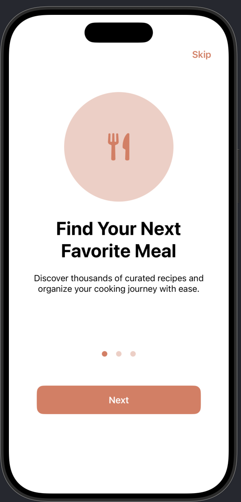
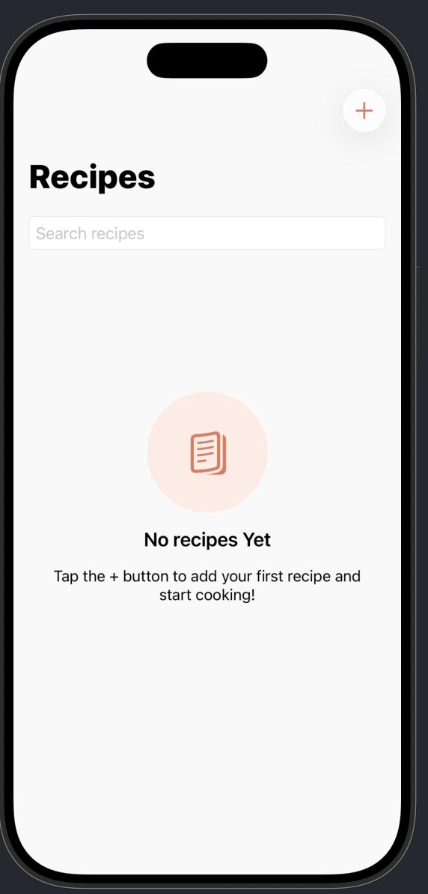
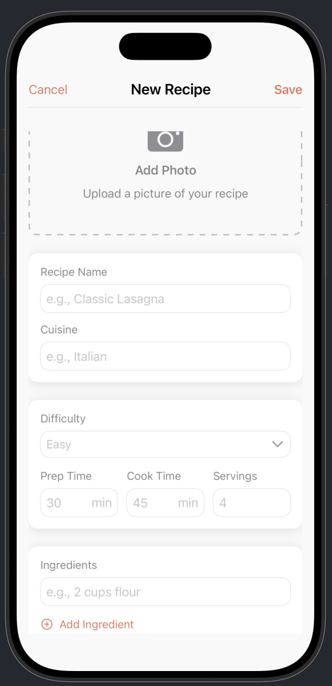
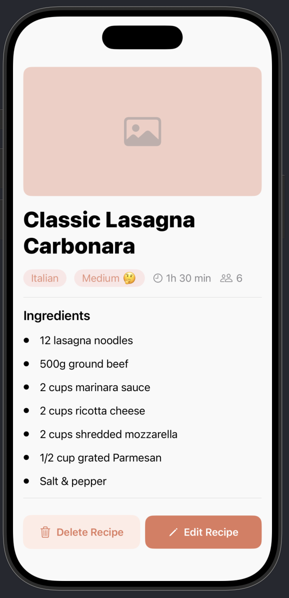

# 🍳 Recipe Book

> An iOS app for organizing and managing your favorite recipes with SwiftData

[](https://swift.org)
[](https://developer.apple.com/xcode/swiftui/)
[](https://www.apple.com/ios/)

---

## 📱 About

Recipe Book is a native iOS application that helps users organize their favorite recipes with detailed information and photos. Built with SwiftUI and SwiftData, the app provides an intuitive interface for managing your culinary collection and never losing a great meal idea again.

### ✨ Key Features

- **📝 Create & Edit Recipes**: Add your own recipes with detailed information
- **📸 Photo Support**: Attach images to your recipes using the built-in photo picker
- **🔍 Smart Search**: Find recipes by name, cuisine, or ingredients
- **ℹ️ Recipe Details**: Track prep time, cook time, servings, difficulty level, and more
- **🎨 Organized View**: Browse all your recipes in a clean, card-based interface
- **💾 Local Storage**: All data stored securely on your device using SwiftData
- **👋 Onboarding Experience**: Smooth first-time user experience

---

## 📝 What I Learned

Building Recipe Book helped me learn several key iOS development concepts:

- **SwiftData**: Implementing Apple's modern persistence framework for local data storage and CRUD operations
- **PhotosUI Integration**: Working with the native photo picker to handle image selection and data conversion
- **Form Validation**: Building dynamic form validation with real-time feedback and conditional button states
- **Search & Filtering**: Implementing efficient search algorithms across multiple data fields with case-insensitive matching
- **Navigation Patterns**: Using NavigationStack with programmatic navigation and modal presentations
- **Custom Styling System**: Creating reusable font extensions and a cohesive color palette for consistent design
- **Data Modeling**: Designing SwiftData models with computed properties and custom enumerations
- **User Onboarding**: Building multi-page onboarding flows with AppStorage for first-launch detection
- **List Management**: Handling dynamic arrays for ingredients and instructions with add/remove functionality
- **Confirmation Dialogs**: Implementing safe delete operations with user confirmation to prevent accidental data loss

---

## 🛠️ Technical Stack

### Technologies & Frameworks
- **Language**: Swift 5.9+
- **UI Framework**: SwiftUI
- **Architecture**: MVVM (Model-View-ViewModel)
- **Data Persistence**: SwiftData for local storage and CRUD operations
- **Photo Handling**: PhotosUI for native photo picker integration

### Design Patterns
- **SwiftData Models**: Persistent data storage with computed properties
- **Custom Enumerations**: Type-safe difficulty levels and cuisine categorization
- **Dynamic Forms**: Real-time validation and conditional UI states
- **Search Algorithms**: Case-insensitive multi-field filtering
- **Confirmation Patterns**: Safe deletion with user confirmation dialogs

---

## 🏗️ Architecture

### MVVM Structure

```
Recipe Book/
├── Models/
│   ├── Recipe.swift              # Core recipe data model
│   └── Recipe+Preview.swift      # Sample data for previews
├── Views/
│   ├── RecipeView.swift          # Main recipe list view
│   ├── RecipeCardView.swift      # Recipe card component
│   ├── RecipeDetailView.swift    # Detailed recipe view
│   ├── AddEditView.swift         # Add/Edit recipe form
│   ├── OnboardingView.swift      # First-time user experience
│   └── OnboardingDetailView.swift
├── Helpers/
│   ├── FontHelper.swift          # Custom font styles
│   └── TimeHelper.swift          # Time formatting utilities
└── RecipeBook.swift              # App entry point
```

### Key Components

#### **Recipe Model**
- SwiftData persistent model with CRUD operations
- Computed properties for formatted display
- Custom enumerations for difficulty and cuisine types
- Optional photo data storage

#### **RecipeView (Main View)**
- Dynamic recipe list with search functionality
- Real-time filtering across multiple fields
- Loading states and empty state handling
- Navigation to detail and add/edit views

#### **RecipeCardView**
- Reusable recipe card component
- Displays recipe photo, name, and key details
- Responsive layout with consistent styling
- Tap gesture for navigation to detail view

#### **AddEditView (Form)**
- Dynamic form with real-time validation
- Photo picker integration for image selection
- Add/remove functionality for ingredients and instructions
- Conditional save button based on validation state

---

## 🎨 Features Deep Dive

### Recipe Management
- **CRUD Operations**: Create, read, update, and delete recipes
- **Form Validation**: Ensures all required fields are filled before saving
- **Photo Integration**: Add and update recipe photos from your library
- **Confirmation Dialogs**: Safe deletion with user confirmation to prevent accidents

### Search & Filter
- **Real-time Search**: Instant results as you type
- **Multi-field Matching**: Search across recipe names, cuisines, and ingredients
- **Case-insensitive**: Smart matching regardless of capitalization
- **Clear Feedback**: Shows filtered results immediately

### Visual Design
- **Custom Color Palette**: Warm terracotta theme with complementary colors
- **Typography Hierarchy**: Custom font extensions for consistent text styling
- **Card-based Layout**: Clean, organized view of all recipes
- **Shadow Effects**: Depth and elevation for visual interest

### User Experience
- **Onboarding Flow**: Multi-page introduction on first launch
- **Empty States**: Helpful prompts when no recipes exist
- **Persistent Storage**: All data saved locally with SwiftData

---

## 🔌 Data Model

### Recipe Structure
Each recipe includes:
- **Name**: Recipe title
- **Cuisine Type**: Categorization (Italian, Mexican, Asian, etc.)
- **Difficulty Level**: Easy, Medium, or Hard
- **Preparation Time**: Minutes to prep
- **Cooking Time**: Minutes to cook
- **Number of Servings**: How many people it serves
- **Ingredients**: List of required ingredients
- **Instructions**: Step-by-step cooking directions
- **Photo**: Optional image (stored as Data)

**SwiftData Integration:**
```swift
@Model
class Recipe {
    var name: String
    var cuisine: String
    var difficulty: Difficulty
    var prepTime: Int
    var cookTime: Int
    var servings: Int
    var ingredients: [String]
    var instructions: [String]
    var imageData: Data?
    
    // Computed properties for formatted display
    var totalTime: Int { prepTime + cookTime }
}
```

---

## 📦 Installation & Setup

### Prerequisites
- Xcode 15.0 or later
- iOS 17.0+ deployment target

### Steps

1. **Clone the repository**
   ```bash
   git clone https://github.com/wahyukw/recipe-book.git
   cd recipe-book
   ```

2. **Open in Xcode**
   ```bash
   open Recipe\ Book.xcodeproj
   ```

3. **Build and Run**
   - Select your target device/simulator
   - Press `Cmd + R` to build and run

---

## 🧪 Code Highlights

### SwiftData Model Definition
```swift
@Model
class Recipe {
    var name: String
    var cuisine: String
    var difficulty: Difficulty
    var prepTime: Int
    var cookTime: Int
    var servings: Int
    var ingredients: [String]
    var instructions: [String]
    var imageData: Data?
    
    var totalTime: Int {
        prepTime + cookTime
    }
}
```

### Search Functionality with Multi-field Filtering
```swift
var filteredRecipes: [Recipe] {
    guard !searchText.isEmpty else { return recipes }
    
    return recipes.filter { recipe in
        recipe.name.localizedCaseInsensitiveContains(searchText) ||
        recipe.cuisine.localizedCaseInsensitiveContains(searchText) ||
        recipe.ingredients.contains { ingredient in
            ingredient.localizedCaseInsensitiveContains(searchText)
        }
    }
}
```

### Photo Picker Integration
```swift
PhotosPicker(selection: $selectedPhoto, matching: .images) {
    if let imageData = recipe.imageData,
       let uiImage = UIImage(data: imageData) {
        Image(uiImage: uiImage)
            .resizable()
            .scaledToFill()
    } else {
        Image(systemName: "photo.badge.plus")
            .font(.largeTitle)
    }
}
.onChange(of: selectedPhoto) { _, newValue in
    Task {
        if let data = try? await newValue?.loadTransferable(type: Data.self) {
            recipe.imageData = data
        }
    }
}
```

---

## 📸 Screenshots

<p float="left">
  
  
  
  
  
</p>

---

## 🤝 Contributing

This is a personal learning project, but feedback and suggestions are welcome! Feel free to:

- Open an issue for bugs or feature requests
- Submit pull requests for improvements
- Share your thoughts on the code architecture

---

## 📄 License

This project is created for educational purposes.

---

## 👨‍💻 Author

**Wahyu Kwan**
- GitHub: [@wahyukw](https://github.com/wahyukw)
- LinkedIn: [wahyukwan](https://www.linkedin.com/in/wahyukwan/)
- Email: wahyukwan@gmail.com

---

## 🙏 Acknowledgments

- Icons from SF Symbols
- Built with SwiftUI and SwiftData
- Inspired by a love of cooking and organization

---

<div align="center">

**Made with SwiftUI**

⭐ Star this repo if you find it helpful!

</div>
